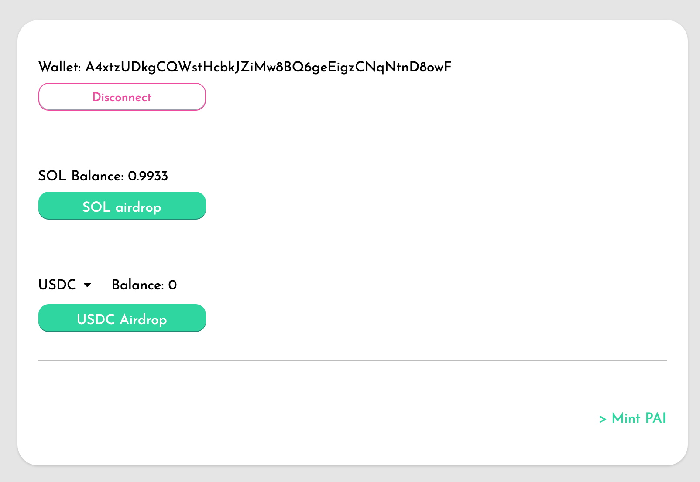

Parrot は Solana の devnet においてテスト目的で利用可能です。

https://dev.partyparrot.finance

このチュートリアルでは、devnet でテスト用のトークンを入手して PAI の発行を行う手順を説明します。

# ウォレットの接続

ページの右上の "Connect Wallet" ボタンをクリックします：

次に接続したいウォレットを選択してください：

# devnet トークンの入手

[Faucet](https://dev.partyparrot.finance/faucet) に移動します。

1. "SOL airdrop" をクリックして、テスト用の 1 SOL を受け取ります。
2. "USDC airdrop" をクリックして、テスト用の 100 USDC を受け取ります。
