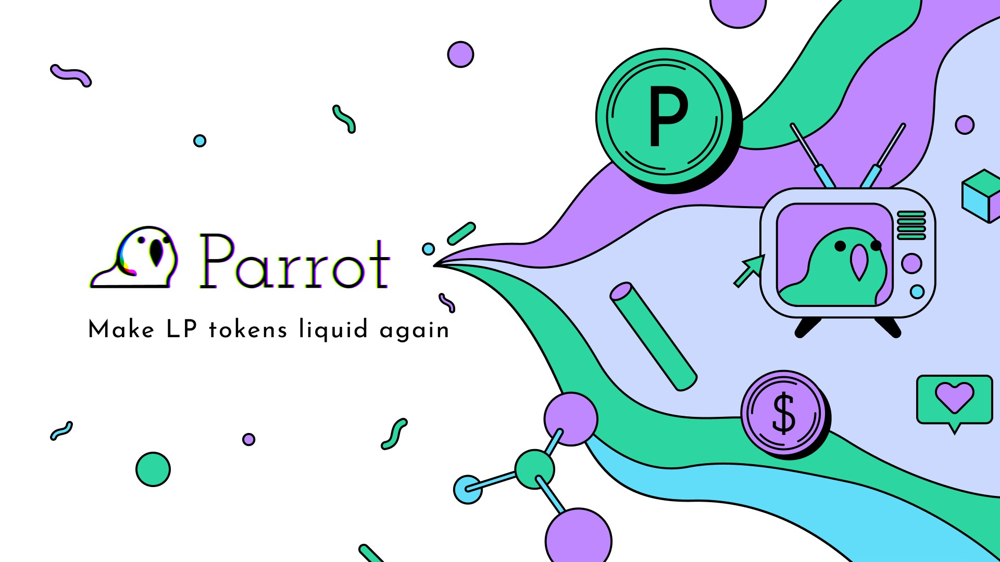

Parrot Protocol は、Solana 上に構築された DeFi ネットワークで、ステーブルコインの PAI と、資産の預託が不要なレンディングマーケット、そしてマージン取引の vAMM から構成されています。 これらはいずれも、DeFi システムにロックされた資産価値へのアクセスを可能にするという一つの問題を解決するために設計されたユースケースです。

現在、何十億ドルもの資産が数百もの DeFi システムにロックされており、Uniswap LP トークンやAAVE 利息トークンといった、さまざまな利息を生むトークンに変換されています。 しかし、これらの LPトークン自体には、あまり多くのユースケースが用意されていません。 LP トークンはリスクが不透明であるため、 DeFi 上で LP トークンとして固定された資産の価値は利用できず、その価値の単位は人間が利用するには適していません。

Parrot Protocol は、LP トークンを担保とした流動性とレンディングネットワークを構築することで、LP トークンの形でロックされた資産価値にアクセスできるようにすることを目指しています。 Parrot の秘密のプランは（ここだけの話ですが）以下のようなものです：

- LP トークンを担保として裏付けられたステーブルコイン PAI の作成。 これは、異なる種類の LP トークンの保有者がお互いに取引しやすいような、共通の取引単位を提供します。
- LP トークンを担保とした Parrot レンディングマーケットの作成。 これにより、LP トークンの保有者は、貸し手の流動性から資産を借りることで、LP トークンにロックされた資産価値にアクセスすることができます。
- PAI を通貨単位としたマージン取引商品（バーチャル AMM または vAMM）の作成。 これによって、Parrot コミュニティは手数料を徴収し、Parrot ファミリーの食い扶持を稼げるようになります。
