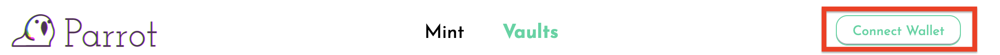
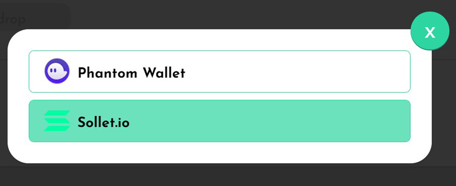
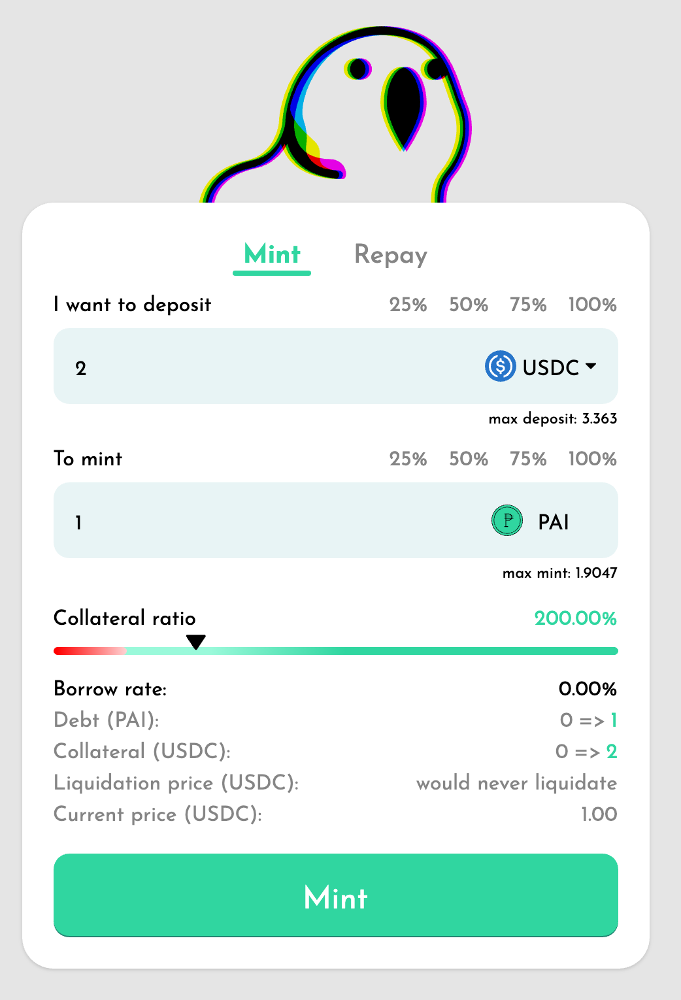
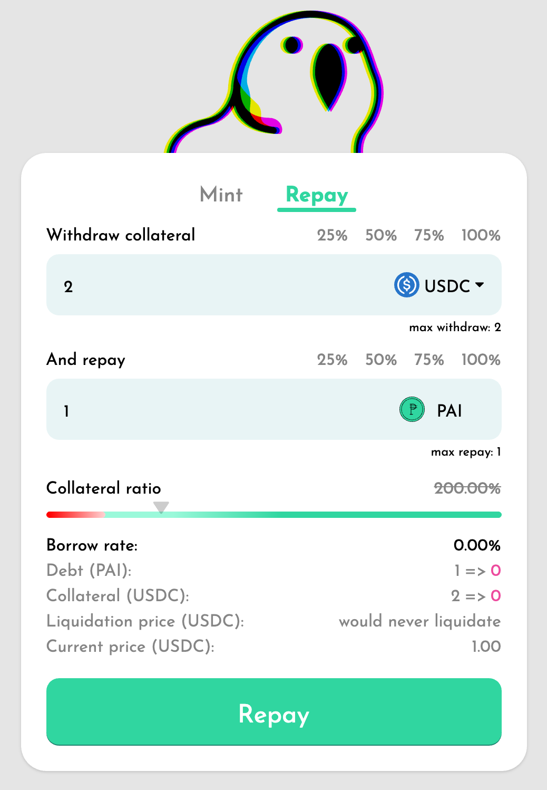
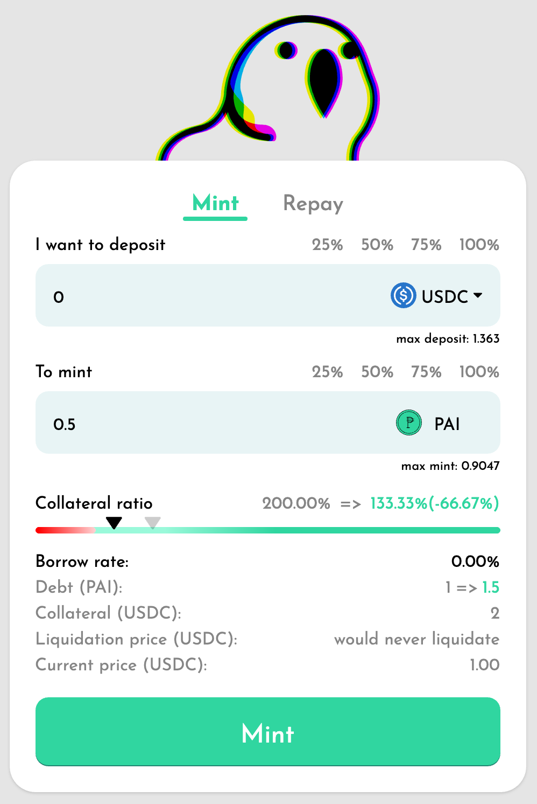
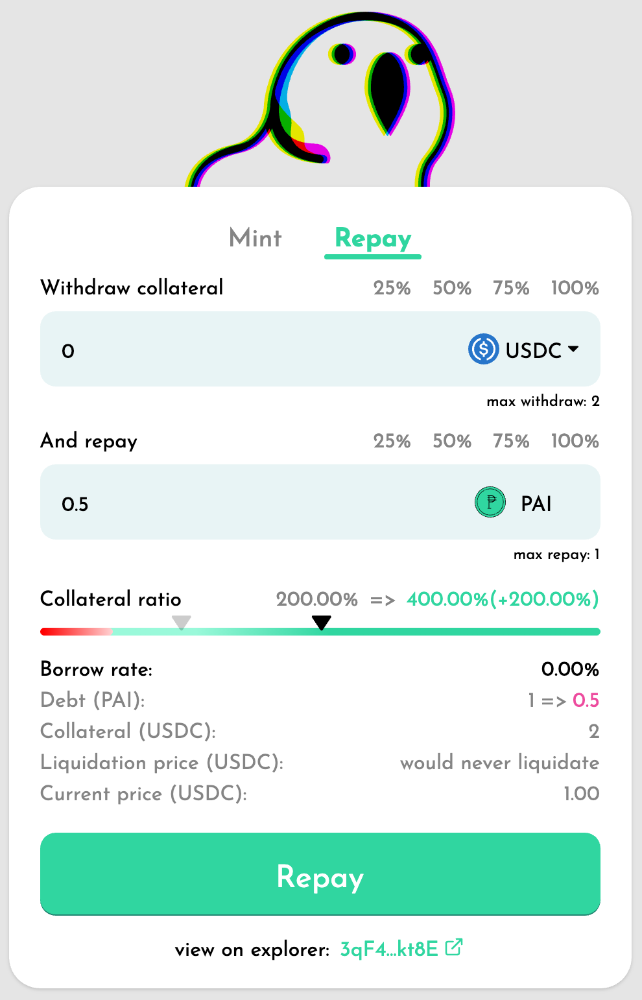
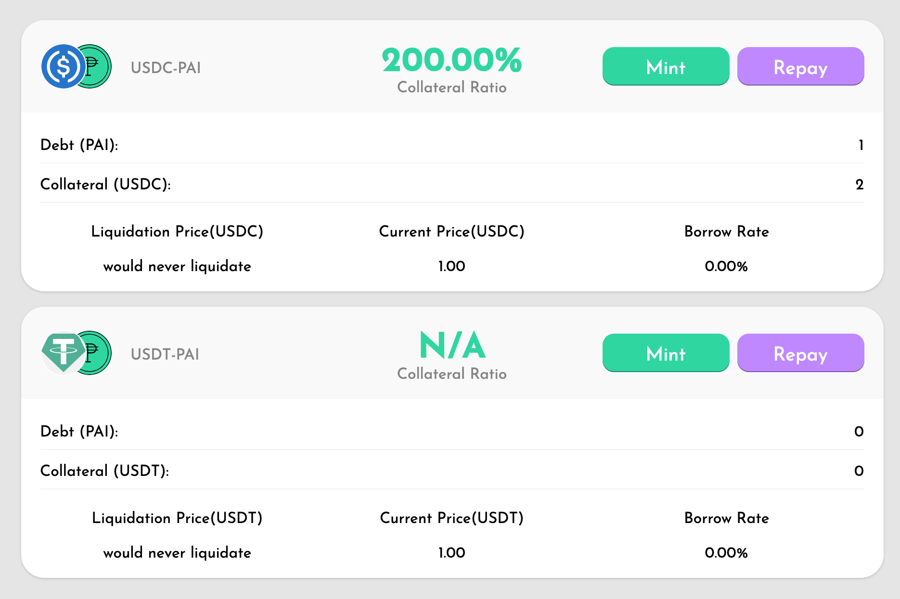

このチュートリアルでは、PAI の発行と返済の手順を一通り説明したいと思います。

現在のところ、Parrot は USDC と USDT の入金のみをサポートしており、担保となる 105 USDC（または 105 USDT）につき 100 PAI を発行することができます。

ステーブルコイン金庫から生成された PAI からは、利息は徴収されません。 さらに、ステーブルコイン金庫については、価格は 1:1 にペッグされるので決して変動しません。 したがって、USDC などのステーブルコイン金庫が強制決済の対象になることはありません。

価格情報を提供するオラクルが Solana のメインネットでローンチされたら、SOL, ETH, BTC といった非ステーブルなアセットにも対応する予定です。

# ウォレットの接続

ページの右上の "Connect Wallet" ボタンをクリックします：

次に接続したいウォレットを選択してください：

# PAI の発行

PAI を発行するには [Mint](https://partyparrot.finance/mint) に移動します。

この例では、2 USDC を担保としてデポジットして、1 PAI を発行しています。発行後は、担保率は 200% ということになります。

# PAI の返済

PAI を返済するには [Mint](https://partyparrot.finance/mint) に移動してから、"Repay" タブに切り替えます。

この例では、1 PAI を返済すると同時に、担保としてデポジットしていた 2USDC  USDC を引き出しています。返済後は、あなたの金庫は空になります。

# 担保率の調整

金庫の担保率に余裕があれば、追加の担保を差し入れなくても、さらに PAI を発行することができます。

この例では、USDC を担保として差し入れることなく、追加の 0.5 PAI を発行しています。発行後、金庫の担保率は 133% に減少します。

金庫の担保率を上げるもう一つの方法として、担保を金庫から引き出さずに PAI を返済することもできます。

この例では、担保は維持したまま 0.5 PAI を返済しています。返済後、金庫の担保率は 400% に増加します。

# 金庫の管理

[Vaults](https://partyparrot.finance/vaults) に移動すれば、金庫の内容を表示したり、金庫の管理をすることができます。

このページでは、金庫の情報を確認し、PAI の発行と返済を行います。

